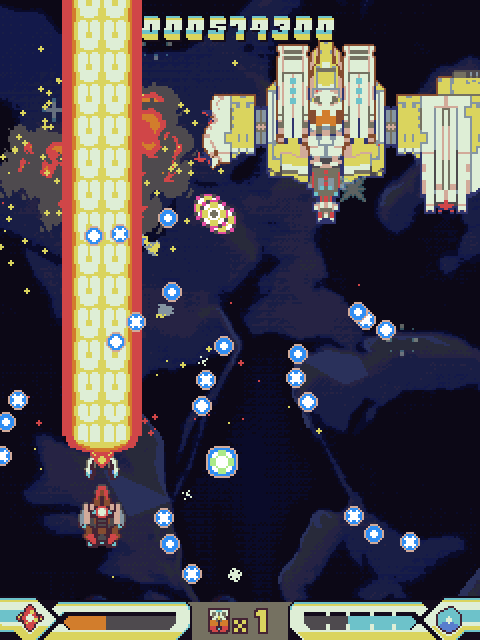
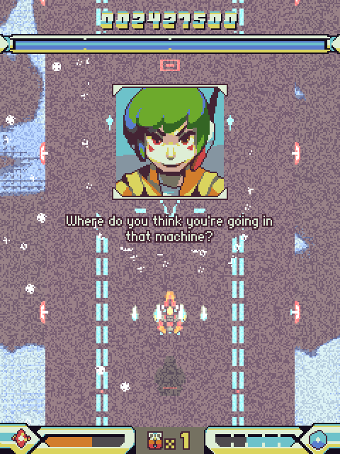
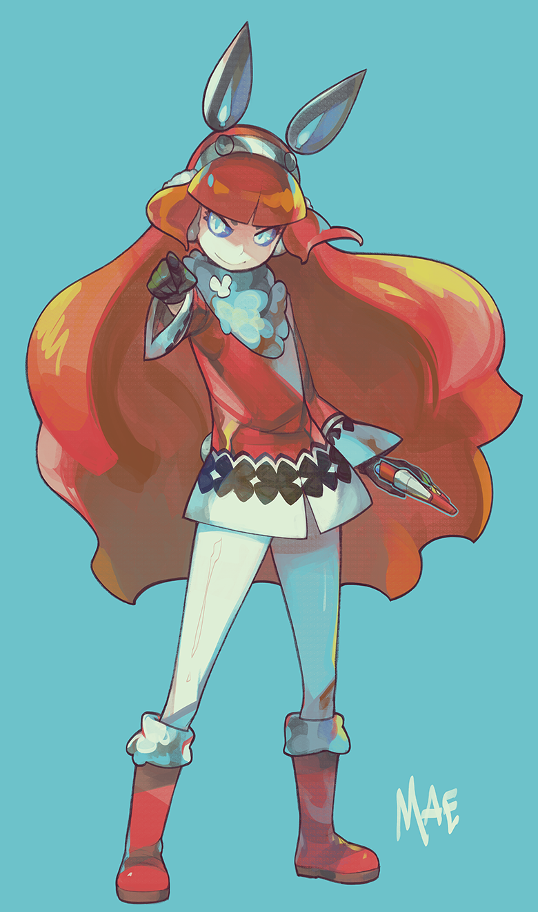
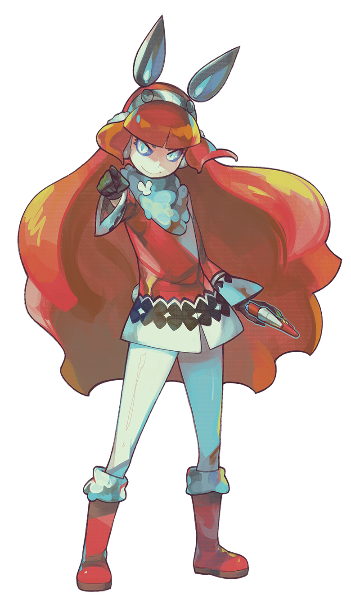

# 

## Factsheet

**Developer:**  
Various

**Website:**  
[bluerevolvergame.com][homepage]

**Press / Business contact:**  
[danbo@bluerevolvergame.com][contact]

**Social:**  
[twitter.com/bluerevolverstg][twitter] 

**Devlog:**  
[bluerevolverstg.tumblr.com][tumblr] 

**Greenlight launch date:**  
3rd February 2015

**Release Date:**  
Summer 2015

**Platforms:**  
Windows / Mac / Linux

**Stores:**  
Steam, Humble, itch.io

**Releases:**  
[v0.15 alpha demo][v015_alphademo]

## Description

Blue Revolver is a fresh new manic shooter for PC. Inspired by the golden age of developers like CAVE and Raizing, we set out to create a challenging, interesting game for expert players - and to provide a set of special features to help new/casual players aspire to greatness.

Mae, bunny-eared technical genius, is pitted against the forces of "Blue Revolver" - a group seeking to confiscate or neutralize her volatile, dangerous creations by sending a few hundred volatile, dangerous enemies at her. Blasting off in a prototype ship armed with a fancy special weapon, she strikes back at the heart of their base!

The style of the game is vibrant but restrained, working at low base resolutions and strict colour palettes to achieve a look that fans are comparing to classic Japanese systems like the Wonderswan Color - though naturally with a lot of hard work, polish and pure energy behind it. 

The defining mechanic of the game is usage of a special weapon - the full version will release with a wide variety of these - a special weapon capable of granting huge score multipliers if used at the right moment or of tearing through tough enemies. Players will have to constantly think about how and where to use the weapon or how to build the 8x chain necessary to rack up a high score - generally while dodging a few hundred bullets in the process.

## Features

* Arcade-authentic, demanding "bullet hell" action
* Deep, nuanced "flourish" system for scoring - easy to learn but hard to master
* 5 stages, plus a second loop for master players
* Daily challenge mode gives players a reason to keep coming back
* Novice mode 
* Post-mortem analysis helps new players understand their play
* Replay / scoreboard support

## History

The team came together some time in August 2014 for Ludum Dare 30, producing a "frantic action" game about a bunnygirl destroying enemies in and out of a mech - [RED ENTITY](http://woofycakes.itch.io/red-entity). The game was fairly well-received, claiming a #21 rating in Fun, #32 in Graphics, #39 in Audio and #41 overall out of over 2,500 entries. It quickly became clear that the team is capable of working together well, and we immediately began work expanding on Red Entity. However, after failing to determine a strong direction for the game to go in, the team decided to work on a manic shooter instead - a genre familiar and interesting to the artists and programmer - and the bunnygirl came along for the ride too in a similarly violent role.

An alpha demo of the game was released on 19th January 2015, and was very well-received by both expert shooter fans and beginners - simple twitter support allowing players to share highscores and compare strategies even at this stage of development. We are currently pursuing Greenlight status (launching our Greenlight page on 3rd February 2015), and hope to release v1.0 this summer. We do not currently intend to release the game as Early Access or to pursue crowdfunding.

## Videos

No trailer yet - some brief gameplay footage! [Youtube](https://www.youtube.com/watch?v=96OOodLX5ns "BLUE REVOLVER Alpha Demo - Gameplay Footage")

<iframe src="//www.youtube.com/embed/96OOodLX5ns" frameborder="0" allowfullscreen></iframe>

## Images

download all screenshots as ** [.zip (385 KB)](assets/images/blue-revolver-screenshots.zip "Images zip") **

download all promo art as ** [.zip (3.31 MB)](assets/images/blue-revolver-promo.zip "Promo zip") **

## Logo

## Articles

> "The level design, animation and fast paced gameplay make for a game fondly reminiscent of classic old-school Cave-style bullet-hell shooters – a fun and challenging game full of retro shmup’ thrills."  
[Alpha Beta Gamer](http://www.alphabetagamer.com/blue-revolver-alpha-demo/)

> "Blue Revolver Is A Love Letter To Cave And Raizing's Shmups"  
[Siliconera](http://www.siliconera.com/2015/01/23/blue-revolver-is-a-love-letter-to-cave-and-raizings-shmups/)

## Team

**woof**  
[art](https://twitter.com/woofycakes)

**danbo**  
[code / design](https://twitter.com/__danbo)

**comic-z**  
[art](https://twitter.com/ComicZ)

**qygen**  
[music](https://soundcloud.com/qygen)

**Wyrm**  
[sound](https://twitter.com/SmilingCorpseHQ)

**Novaturtle**  
[music](https://soundcloud.com/l-hartley/)  

## Contact

**Inquiries**  
[danbo@bluerevolvergame.com][contact]

**Twitter**  
[twitter.com/bluerevolverstg][twitter]

<!--- =====================================================================  -->
<!--- Referenced links -->

[homepage]: http://companydomain.com "Company Name"
[tumblr]: http://bluerevolverstg.tumblr.com
[contact]: mailto:danbo@bluerevolvergame.com

<!--- Social -->

[twitter]: https://twitter.com/bluerevolverstg
[facebook]: https://facebook.com/companyname
[skype]: callto:companyskypename

[v015_alphademo]: http://woofycakes.itch.io/blue-revolver-demo