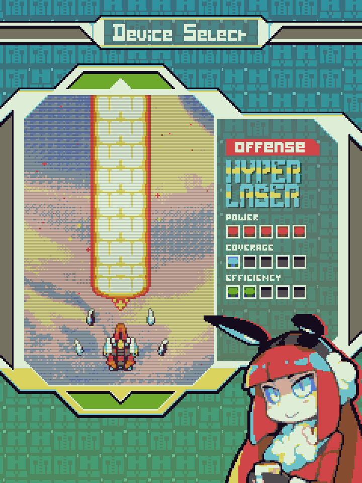
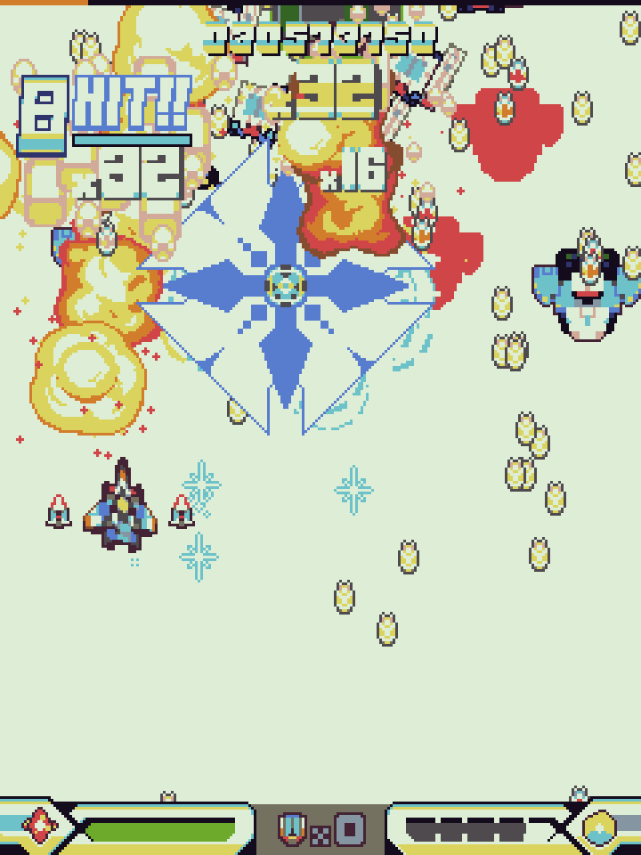

# 

## Factsheet

**Developer:**  
Stellar Circle

**Website:**  
[bluerevolvergame.com][homepage]

**Press / Business contact:**  
[danbo@bluerevolvergame.com][contact]

**Social:**  
[twitter.com/bluerevolverstg][twitter] 

**Youtube:**  
[link][youtube]

**Devlog:**  
[bluerevolverstg.tumblr.com][tumblr] 

**Greenlight page:**  
[link][greenlight]

**Release Date:**  
11th October 2016

**Platforms:**  
Windows / Mac / Linux

**Stores:**  
Steam, Humble, itch.io

**Releases:**  
[v0.5 demo][v05_demo]

## Description

Blue Revolver is a fresh new manic shooter for Windows, OS X and Linux. Inspired by a lifetime of playing arcade classics from developers like CAVE and Raizing, we set out to create a challenging, rich game for expert players - and to provide some special features to help introduce newer or more casual players.

The game's world is one that can be manipulated, in a magic-like way, through code and scripts. And sadly - Mae, the protagonist of the game, isn't quite as smart as she thinks she is. While she's a self-professed genius programmer, her sloppy creations and devices present a huge environmental risk for the game's world due to the creation of harmful junk data. And so, she is turned against the forces of "Blue Revolver" - an environmental group out to confiscate or neutralize her volatile, dangerous creations. Blasting off in her most dangerous device armed with a fancy special weapon, she strikes back!

The game works at a low base resolution and a strict colour palette to achieve a crisp, crunchy pixel art style. Eric Muentes, aka "woof", brings his unique, colourful art style to the game. We're not exactly sure we could get the game running on a Game Boy Advance, but it'd look about right!

**Blue Revolver's three key features are :**

* The special weapon and "flourish" system. The special weapons are great at cutting through tough enemies or blocking enemy attacks, but they truly shine when used at exactly the right time - providing the crazy flourish to a short chain of enemies and generating huge score multipliers! Players have to constantly consider how and when to use the weapon, managing their ammo - because naturally, scoring big awards plenty of extra lives...
* The adaptive difficulty system. Under the hood, the game uses 5 difficulty "levels" that it can switch between on the fly. Scoring big and staying alive slowly climbs the player up these difficulty levels, but dying will always drop the player down at least one level. 
* The mission mode, which breaks the game up into 24 single-stage missions. Some offer strict scoring or survival challenges, others are intended to build the player's skills indirectly through things like odd experimental weapons, bullets that fade out and big pursuer bullets.

Thank you for your interest in the game! If you represent a review site or blog, you can [email us][contact] to request a key. If you run a YouTube or Twitch channel, please [message us directly through Youtube][youtube_about] - we are unable to grant keys directly to Youtubers or streamers through email.

## Videos

Trailer coming very soon - for now, some brief gameplay footage! 

<iframe src="//www.youtube.com/embed/Tq5g4kc842U" frameborder="0" allowfullscreen></iframe>

## Discussion points

**We realise it may be difficult to cover this game.** The game is highly demanding, intended to be slowly learned over the course of weeks and months to experience everything on offer. To help provide a starting point for discussion and to provide some context for your own experiences with the game, we have supplied a few talking points here that you may find interesting :

* When we started work on this game, we wanted to create a "stepping stone" into the genre. At the time, there were few beginner-friendly games that can be easily acquired for PC and picked up. We knew that making something like this would be more involved than simply making an easy mode and hoping for the best :
    * For example, rather than making a perfectionist, "perfect line" type of scoring system, BR's scoring system is based around many big, independent moments and strokes of genius. The player also has many tools to deal with poor execution - even scoring badly in this game can feel very good once you have the basics down. Early mistakes are designed not to cripple scoring or survival runs.
    * The adaptive difficulty system is completely visible to the player. Many arcade games implement similar systems, but these are usually intended more to make the game harder on experienced players than to make it more forgiving for new players - and almost never make it visible and understandable for players.
    * This design goal informs nearly everything about the game - it would be too long to go over everything, please [email us][contact] if you'd like to discuss more.
* We initially intended for this project to be over and done with in about 10 months. Instead it took roughly 2 years. Shmups are often presented to new developers as the easiest type of simple game to make, but nothing is easy if you're passionate about it.
* We prefer the term "manic shooter" to terms like "bullet hell" or "danmaku" (though we won't get upset if this is how you describe the game!)
    * This is partially due to the game's comparatively high tempo and sparse bullet patterns.
    * It is also because the latter terms can present these games as some sort of odd masochism or strange punishment - rather than a manic, joyful struggle.

## Features

* Arcade-authentic, demanding shooting action
* Adaptive difficulty system
* 3 game modes - Normal, Hyper and Parallel
* Deep, nuanced "flourish" system for scoring - easy to learn but hard to master
* 5 stages, plus a true last boss for master players
* "Mission" mode, intended to teach players the basic skills
* 2 pilots, 3 shot types each, 4 special weapons each
* Rebindable controls, full screen options, etc
* Unlockable art, remix tracks and other goodies - unlockable by clearing missions or attempting/completing full clears of the game
* *Steam leaderboards, replay support and achievements are planned for a post-release update.*

## History

The team came together some time in August 2014 for Ludum Dare 30, producing a "frantic action" game about a bunnygirl destroying enemies in and out of a mech - [RED ENTITY](http://woofycakes.itch.io/red-entity). The game was fairly well-received, claiming a #21 rating in Fun, #32 in Graphics, #39 in Audio and #41 overall out of over 2,500 entries. It quickly became clear that the team is capable of working together well, and we immediately began work expanding on Red Entity. However, after failing to determine a strong direction for the game to go in, the team decided to work on a manic shooter instead - a genre familiar and interesting to the artists and programmer - and the bunnygirl came along for the ride too in a similarly violent role.

An alpha demo of the game was released on 19th January 2015, and was very well-received by both expert shooter fans and beginners - simple twitter support allowing players to share highscores and compare strategies even at this stage of development. Our Greenlight campaign was a quick success (link [here][greenlight]).

A v0.5 3-stage demo of the game was released on 7th September, showing off more content and polish - this demo also featured at Comiket 88. This demo also came with a month-long score challenge - beating the benchmark of 20 million and supplying a video of the run would secure the player a spot in the credits.

Since then, the game has been shown in various states at a few events and conventions - Touhoucon 2015, Play EXPO Glasgow 2016. Response was generally positive at these events, with several shooter fans appearing specifically to see Blue Revolver.

We are planning on a full release in October 2016. We have not used Early Access or crowdfunding.

## Screenshots

download all screenshots as ** [.zip (2.26 MB)](assets/images/screenshots/bluerev_launch_screenshots.zip "Images zip") **

## Art

download all art as ** [.zip (9.71 MB)](assets/images/art/bluerev_launch_art.zip "Promo zip") **

## Logo

## Articles

> "Blue Revolver is a SHMUP with Real Personality"
[Hardcore Gamer](http://www.hardcoregamer.com/2015/02/11/blue-revolver-is-a-shmup-with-real-personality/133904/)

> "there’s a level of knowledge in Blue Revolver’s design that’s atypical of a small developer at this point in development"
[Kritiqal](http://kritiqal.com/2015/03/25/indie-impressions-blue-revolver/)

> "The level design, animation and fast paced gameplay make for a game fondly reminiscent of classic old-school Cave-style bullet-hell shooters – a fun and challenging game full of retro shmup’ thrills."  
[Alpha Beta Gamer](http://www.alphabetagamer.com/blue-revolver-alpha-demo/)

> "Blue Revolver Is A Love Letter To Cave And Raizing's Shmups"  
[Siliconera](http://www.siliconera.com/2015/01/23/blue-revolver-is-a-love-letter-to-cave-and-raizings-shmups/)

## Team

**woof**  
[art](https://twitter.com/woofycakes)

**danbo**  
[code / design](https://twitter.com/__danbo)

**comic-z**  
[art](https://twitter.com/ComicZ)

**qygen**  
[music](https://soundcloud.com/qygen)

**Wyrm**  
[sound](https://twitter.com/SmilingCorpseHQ)

**Novaturtle**  
[music](https://soundcloud.com/l-hartley/)  

## Contact

**Inquiries**  
[danbo@bluerevolvergame.com][contact]

**Twitter**  
[twitter.com/bluerevolverstg][twitter]

<!--- =====================================================================  -->
<!--- Referenced links -->

[homepage]: http://bluerevolvergame.com "Blue Revolver"
[tumblr]: http://bluerevolverstg.tumblr.com
[contact]: mailto:danbo@bluerevolvergame.com
[youtube]: https://www.youtube.com/channel/UCuRdRykIm7OkgU-vCVoEj4g
[youtube_about]: https://www.youtube.com/channel/UCuRdRykIm7OkgU-vCVoEj4g/about

<!--- Social -->

[twitter]: https://twitter.com/bluerevolverstg
[skype]: callto:tinydanbo

[v015_alphademo]: http://woofycakes.itch.io/blue-revolver-demo
[v05_demo]: http://woofycakes.itch.io/blue-revolver-v05
[greenlight]: http://steamcommunity.com/sharedfiles/filedetails/?id=380437841
