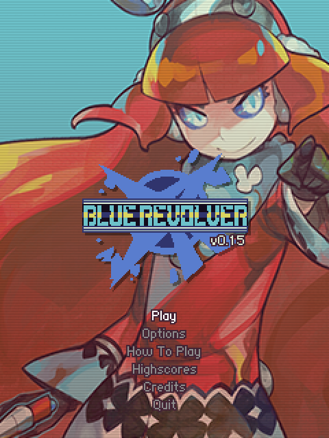
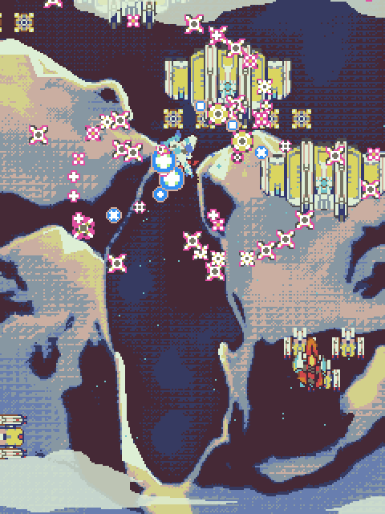
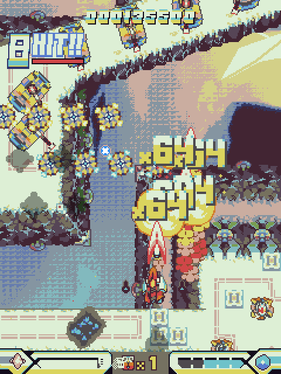
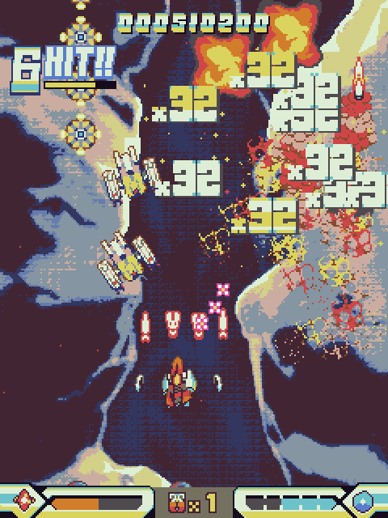
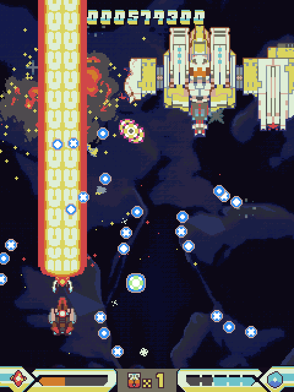
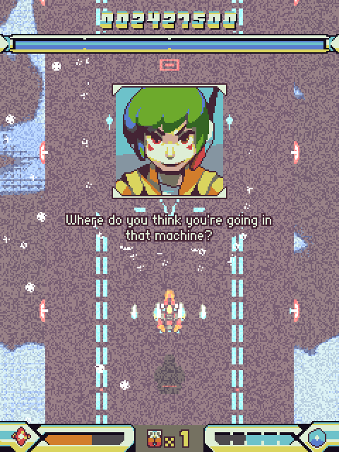
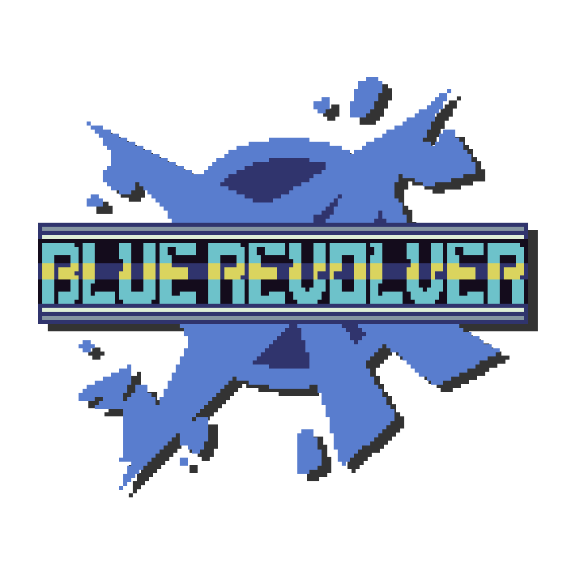

# 

## Factsheet

**Developer:**  
Team Chain Drain

**Release Date:**  
August 2015

**Platforms:**  
[Windows / Mac / Linux](http://woofycakes.itch.io/blue-revolver-demo)   

**Website:**  
[bluerevolvergame.com](http://bluerevolvergame.com)

**Regular Price:**  
TBD

## Description

Blue Revolver is a fresh new shmup/STG influenced by the golden age of developers like CAVE and Raizing. 

## History

Lorem ipsum dolor sit amet, consectetur adipiscing elit, sed do eiusmod tempor incididunt ut labore et dolore magna aliqua. Ut enim ad minim veniam, quis nostrud exercitation ullamco laboris nisi ut aliquip ex ea commodo consequat. Duis aute irure dolor in reprehenderit in voluptate velit esse cillum dolore eu fugiat nulla pariatur. Excepteur sint occaecat cupidatat non proident, sunt in culpa qui officia deserunt mollit anim id est laborum.

## Features

* Deep, nuanced scoring system - easy to learn but hard to master
* 5 stages, plus a second loop for master players
* Daily challenge mode gives players a reason to keep coming back
* Novice mode 
* Post-mortem analysis helps new players understand their play
* Replay / scoreboard support

## Videos

Trailer coming soon - here's a random stream of the game! [Youtube](https://www.youtube.com/watch?v=sWlP8SFIe94 "Blue Revolver v0.15 (Demo) -- First Play/Score Attack Jan 21st 2014")

<iframe src="//www.youtube.com/embed/sWlP8SFIe94" frameborder="0" allowfullscreen></iframe>

## Images

download all screenshots & photos as ** [.zip (385 KB)](assets/images/images.zip "Images zip") **

## Logo

## Awards & Recognition

> * "Winner, XX awards." - *December 13, 2013*
> * "Nominee, YY awards." - *December 13, 2013*

## Selected Articles

> * "Put a quote here, from someone who talked about your game."  
-- *Person Name, [Website](http://www.website.com/)*

> * "More quotes. Make sure to quote people properly! No trimming!"  
-- *Person name, [Site](http://geocities.blog.com/)*

## Additional Links

**Playable alpha demo**  
We released a playable alpha demo on itch.io on the 19th - play it [here!](http://woofycakes.itch.io/blue-revolver-demo) This is just a demo of the core gameplay, some of the big features are not in this.

## Credits
 
**woof**  
[art](https://twitter.com/woofycakes)

**danbo**  
[code, design](https://twitter.com/__danbo)

**Comic-Z**  
[art](https://twitter.com/ComicZ)

**qygen**  
[music](https://soundcloud.com/qygen)

## Contact

**Inquiries**  
[danbo@bluerevolvergame.com][contact]

**Twitter**  
[twitter.com/bluerevolverstg][twitter]

**Web**  
[bluerevolvergame.com][homepage]

<!--- =====================================================================  -->
<!--- Referenced links -->

[homepage]: http://bluerevolvergame.com "Blue Revolver"

[contact]: mailto:danbo@bluerevolvergame.com

<!--- Social -->

[twitter]: https://twitter.com/bluerevolverstg
